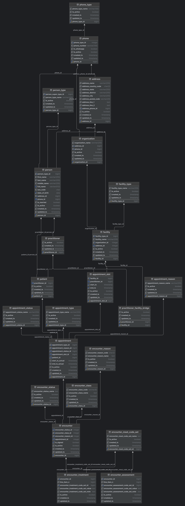

# The EHR Platform Project

This is an attempt to create a simple medical platform using Postgres.

Electronic health record (EHR) systems are digital records of a patient's
medical history that are used by healthcare systems to collect
and store patient information.

## Overview



## Installation

The project implies Docker, Docker Compose and official [Postgres Image](https://hub.docker.com/_/postgres).

```bash
docker-compose up
```

## License

[MIT](https://choosealicense.com/licenses/mit/)
